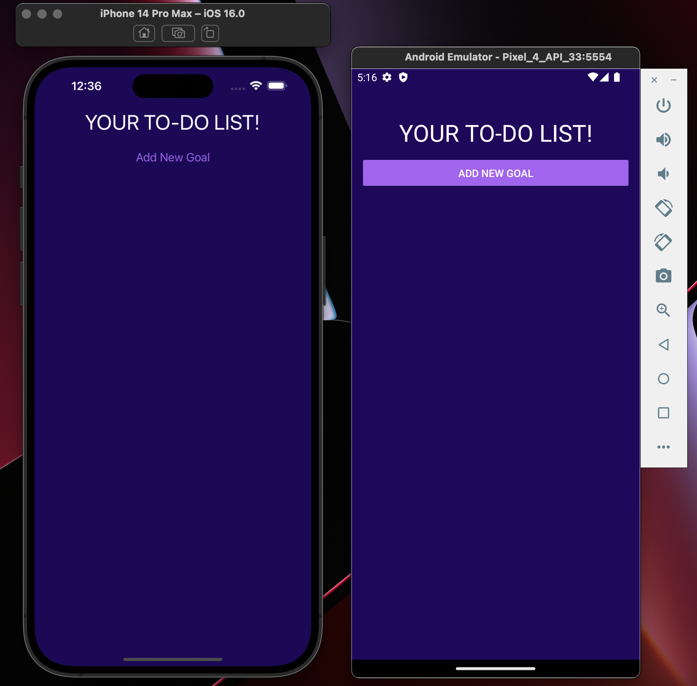
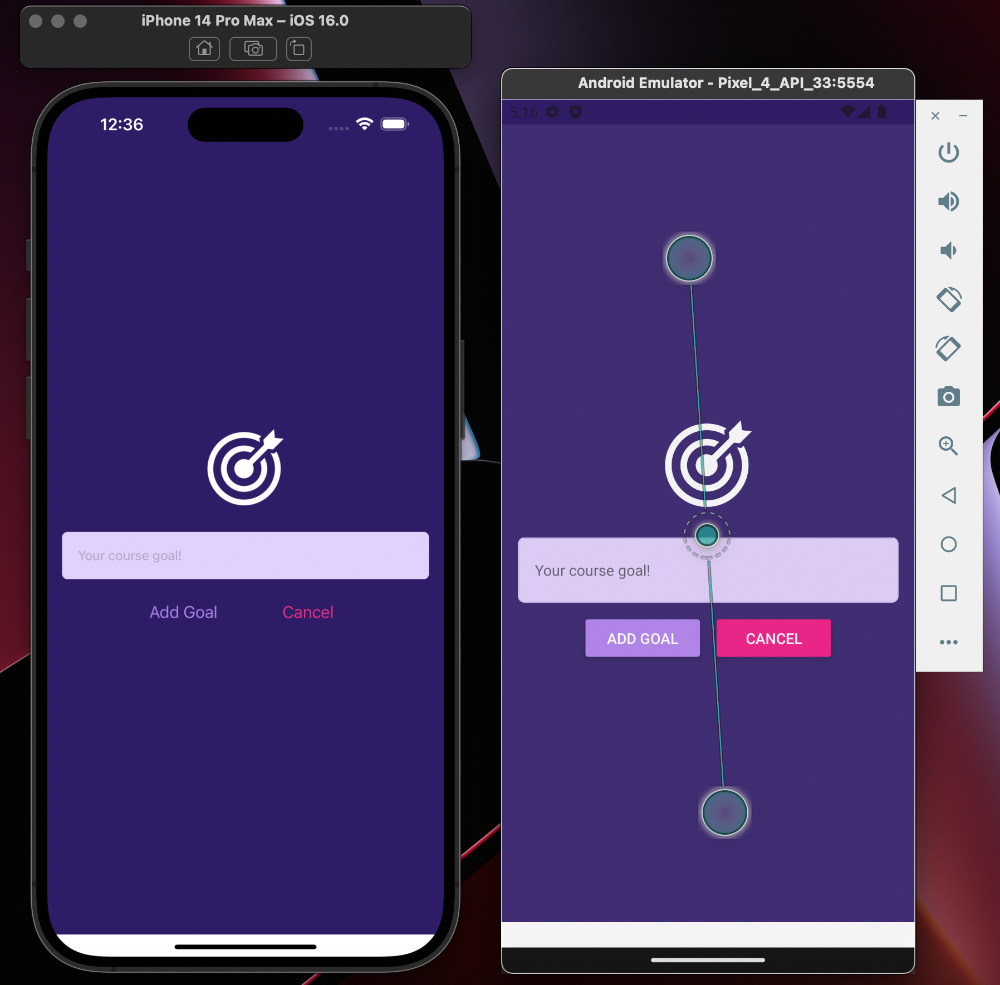

# TO-DO LIST MOBILE APPLICATION

<p>This is a simple to-do list application implemented by the React Native library</p>
<br>



<br>
<br>



### STARTING

```
npm start
```

Assuming that you are using MacOS and know how to open the development tools 
(Android Studio for Android simulators and XCode for Iphone simulators):

```
i: IOS review
a: Android review
r: Refresh your application
```
